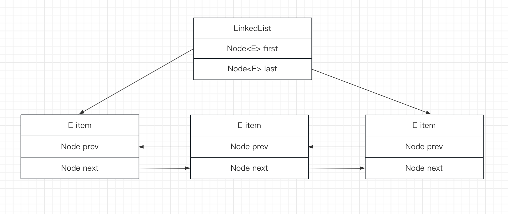
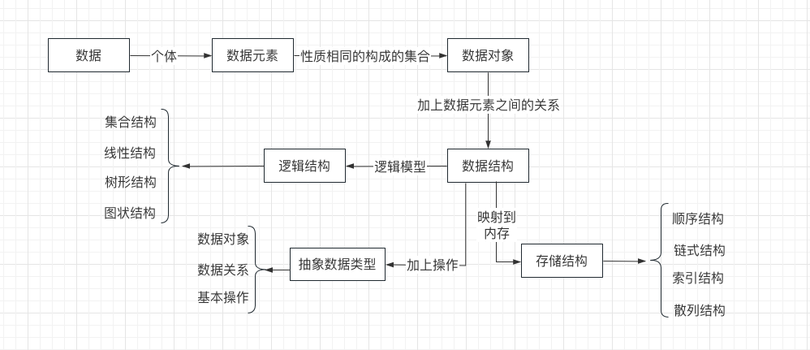

# 1.基本概念

图灵奖1984年的得主 Nicklaus Wirth，曾提出过一个著名的公式：程序 = 数据结构 + 算法。可见编写优秀的程序，离不开数据结构和算法的支撑。

## 1.数据

- 数据：是指能够被计算机识别和处理的各种符号的集合，是对客观事物的描述，作为信息的载体。包括数值类型(整数、实数等)、非数值类型(文字、图像等)；
- 数据元素：是数据的基本单位，在计算机程序中通常作为一个整体来处理，也称之为记录，类似于表格中的一行数据，是一个完整的元素；
- 数据项：构成数据元素的不可分割的最小单位，即数据行中的一个单元格数据；
- 数据对象：性质相同的数据元素的集合，是数据的一个子集，例如整数数据对象，就是所有整数的集合；

---

## 2.数据结构

数据元素不是孤立存在的，它们之间存在着某种关系，数据元素相互之间的关系称之为结构。数据结构，也可以理解为带结构的数据元素的集合。

### 2.1.数据结构的组成

- 数据元素之间的逻辑关系，称为**逻辑结构**；
- 数据元素及其关系在计算机内存中的表示，称为**存储结构**；
- 数据的**运算和实现**，是指对数据元素可以施加的操作，以及这些操作在相应的存储结构上的实现；

### 2.2.数据结构的层次

**逻辑结构：**

- 描述数据元素之间的逻辑关系；
- 与数据的存储无关，独立于计算机；
- 是从具体问题抽象出来的数学模型；

**存储结构：**

- 数据元素及其关系在计算机存储器中的结构；
- 是数据结构在计算机中的表示；

### 2.2.逻辑结构的种类

**划分方式一，线性与非线性：**

- 线性结构：有且只有一个开始和一个终端节点，并且所有节点最多只有一个直接前驱和一个直接后继，例如：线下表、栈、队列等；
- 非线性结构：一个节点可能有多个直接前驱和直接后继，例如：树、图；

**划分方式二，四种基本逻辑结构：**

- 集合结构：结构中的数据元素除了同属于一个集合的关系外，无任何其他关系；
- 线性结构：结构中的数据元素之间存在着一对一的线性关系；
- 树形结构：结构中的数据元素之间存在着一对多的层次关系；
- 图状结构：结构中的数据元素之间存在着多对多的任意关系；

### 2.3.存储结构的种类

**顺序存储结构：**

用一组连续的存储单元依次存储数据元素，数据元素之间的逻辑关系由元素的存储位置来表示。Java语言中用数组来实现顺序存储结构，在实际使用中可以进一步抽象为ArrayList：

```java
String[] array = {"bat", "cat", "eat", "mat"};

List<String> list = new ArrayList<>();
```

**链式存储结构：**

用一组任意的存储单元存储数据元素，数据元素之间的逻辑关系用指针来表示。Java语言中使用LinkedList来实现链表：

```java
LinkedList linkedList = new LinkedList<>();
```



**索引存储结构：**

- 在存储节点信息的同时，还建立附加的索引表；
- 索引表中的每一项称之为索引项；
- 索引项目的一般形式是：(关键字，地址)；
- 关键字是能唯一标识一个节点的数据项；

**散列存储结构：**

根据节点的关键字直接计算出该节点的存储地址。Java语言中使用HashMap实现散列结构, HashMap放入元素源码：

```java
public V put(K key, V value) {
    return putVal(hash(key), key, value, false, true);
}

static final int hash(Object key) {
		int h;
    return (key == null) ? 0 : (h = key.hashCode()) ^ (h >>> 16);
}
```

### 2.4.数据类型和抽象数据类型

数据类型是一组性质相同的值的集合，以及定义于这个值集合上的一组操作的总称。

抽象数据类型，是指一个数学模型以及定义在此数学模型上的一组操作：

- 由用户定义，从问题抽象出数据模型（逻辑结构）；
- 还包括定义在数据模型上的一组抽象运算（相关操作）；
- 不考虑计算内的具体存储结构与运算的具体实现算法；

### 2.5.总结



---

## 3.抽象数据类型

### 3.1.形式定义

抽象数据类型(Abstract Data Type, ADT)可以用(D, S, P)三元组表示，其中：D是数据对象、S是D上的关系集，P是对D的基本操作集。

**一个抽象数据类型的定义格式如下：**

```java
ADT 抽象数据类型名{
		数据对象：数据对象的定义
		数据关系：数据关系的定义
		基本操作：基本操作的定义
} ADT 抽象数据类型名
```

**基本操作定义格式：**

参数表：赋值参数，为操作提供输入值，以及操作结果的返回值；

初始条件：描述操作执行之前数据结构和参数应满足的条件；

操作结果：说明操作正常完成之后，数据结构的变化状况和应返回的结果；

### 3.2.表示与实现

一个问题抽象为一个抽象数据类型后，仅是形式上的抽象定义，为了达到解决问题的目的，就需要把抽象的变成具体的，变成一个能用的具体的数据类型。

抽象数据类型，可以通过固有的数据类型（如整型、字符型等）来表示和实现。

### 3.3.抽象数据类型”复数”的实现

使用Java语言实现复数的定义、计算：

```java
//复数
public class ComplexNumber {
    private float realPart;  //实部
    private float imagePart;  //虚部
}

//计算
public interface ComplexCalculate {
    ComplexNumber assign(float real, float image);
    ComplexNumber add(ComplexNumber a, ComplexNumber b);
    ComplexNumber minus(ComplexNumber a, ComplexNumber b);
    ComplexNumber multiply(ComplexNumber a, ComplexNumber b);
    ComplexNumber divide(ComplexNumber a, ComplexNumber b);
}
```

---

## 4.算法

算法是对特定问题的求解方法和步骤的一种描述，是指令的有限序列。其中每个指令表示一个或者多个操作。

### 4.1.算法与程序

- 算法是解决问题的一种方法或者一个过程，考虑如何将输入转换成输出，一个问题可以有多种算法；
- 程序是用某种程序设计语言对算法的具体实现；

### 4.2.算法特性

- 有穷性：一个算法必须总是在执行有穷步之后结束，且每一步都在有穷时间内完成；
- 确定性：算法中的每一条指令必须有确切的含义，没有二义性，在任何条件下，只有唯一的一条执行路径，即对于相同的输入只能得到相同的输出；
- 可行性：算法是可执行的，算法描述的操作可以通过已经实现的基本操作执行有限次来实现；
- 输入：一个算法有零个或者多个输入；
- 输出：一个算法有一个或者多个输出；

### 4.3.算法设计的要求

- 正确性；
- 可读性；
- 健壮性；
- 高效性；

### 4.4.算法分析

算法分析的目的是看算法实际是否可行，并在同一个问题存在多种算法时进行性能上的比较，以便从中挑选出比较优的算法。

**算法效率：**

- 时间效率：指的是算法所耗费的时间；
- 空间效率：指的是算法执行过程中所耗费的存储空间；

备注：时间效率和空间效率有时候是矛盾的。

**分析方法：**

一个算法的运行时间是指一个算法在计算机上运行所耗费的时间大致可以等于计算机执行一种简单的操作（如赋值、比较、移动等）所需的时间与算法中进行的简单操作次数乘积。

算法运行时间 = ∑每条语句的执行次数 * 该语句执行一次所需的时间

每条语句执行一次所需的时间，取决于机器的指令性能、速度以及编译的代码质量，由硬件环境决定，和算法无关。因此可以假设每条语句所需的时间均为单位时间，对算法运行时间的讨论就可以转化为讨论该算法中所有语句的执行次数，即频度之和。

**时间复杂度的渐进表示法：**

- 为了方便比较不同算法的时间效率，我们仅比较它们的数量级；
- 若有某个辅助函数f(n)，使得当n趋近于无穷大使，T(n)/f(n)的极限值为不等于零的常数，则称f(n)是T(n)的同数量级函数。记作T(n)=O(f(n))，称O(f(n))为算法的渐进时间复杂度，O为数量级符号。

例如：两个n * n矩阵相乘的算法描述：

```java
for (int i=1; i<=n; i++){
	  for (int j=1; j<=n; j++){
		    c[i][j] = 0;
        for (int k=0; k<n; k++){
		        c[i][j] = c[i][j] + a[i][k] * b[k][j];
        }
    }
}
```

算法消耗时间：T(n) = 2n^3 + 2n^2 + 2n + 1，使用渐进表示法，当n → ∞时， T(n)/n^3 → 2，表示n充分大使，T(n)与n^3是同阶的，因此可记作：

**T(n)  = O(n^3)** 

### 4.5.算法时间复杂度

算法中基本语句重复执行的次数是问题规模n的某个函数f(n)，算法的时间量度记作：T(n) = O(f(n))，表示随着n的增大，算法执行的时间的增长率和f(n)的增长率相同，称为渐进时间复杂度。

**基本分析方法：**

1. 找出语句频度最大的那条语句作为基本语句；
2. 计算基本语句的频度得到问题规模n的某个函数f(n)；
3. 取其数量级用符号O表示；

**计算方法：**

- 加法法则：总复杂度等于量级最大的那段代码的复杂度；
- 乘法法则：嵌套代码的复杂度等于嵌套内外代码复杂度的乘积；

**与数据规模的关系：**

有时候，算法中基本操作重复执行的次数还随着问题的输入数据集不同而不同，例如在数组中执行顺序查找；衍生出不同类型的复杂度：

- 最坏时间复杂度：指在最坏情况下，算法的时间复杂度；
- 平均时间复杂度：指在所有可能输入实例在等概率出现的情况下，算法的期望运行时间；
- 最好时间复杂度：指在最好情况下，算法的时间复杂度；

一般总是考虑着最坏情况下的时间复杂度，以保证算法的运行时间不会比它更长。

**几种常见的时间复杂度：**

- 常量阶 O(1)，常量级时间复杂度的一种表示方法，并不是指只执行了一行代码。只要代码的执行时间不随 n 的增大而增长；
- 对数阶 O(logn)，针对问题规模n，执行次数为x，满足2^x = n，求解得到x=log2n，时间复杂度就是 O(log2n)；
- 线性阶 O(n)；
- 指数阶 O(2^n)；
- 平方阶 O(n^2)；

### 4.6.渐进空间复杂度

空间复杂度是算法所需存储空间的度量，记作：S(n) = O(f(n))，其中n为问题的规模。

算法需要占据的空间：

- 算法本身要占据的空间，输入输出、指令、常数、变量等；
- 算法要使用的辅助空间；

例如：将一维数组a中的n个数逆序存放到原数组中：

```java
//算法一，空间复杂度: S(n) = O(1)
for (int i=0; i<n/2; i++){
    t = a[i];
    a[i] = a[n-i-1];
    a[n-i-1] = t;
}

//算法二，空间复杂度：S(n) = O(n)
for (int i=0; i<n; i++){
    b[i] = a[n-i-1];
}
for (int i=0; i<n; i++){
    a[i] = b[i];
}
```

---