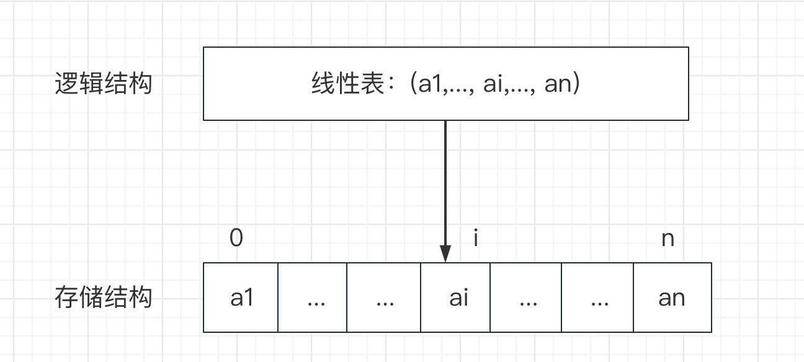
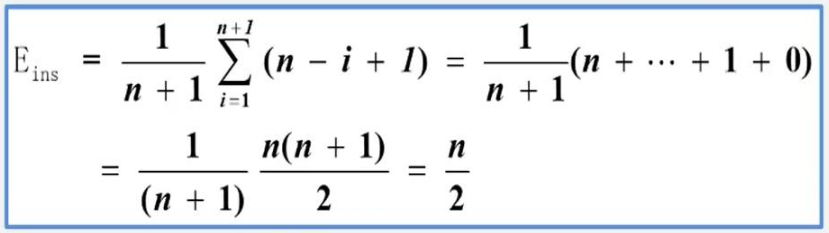
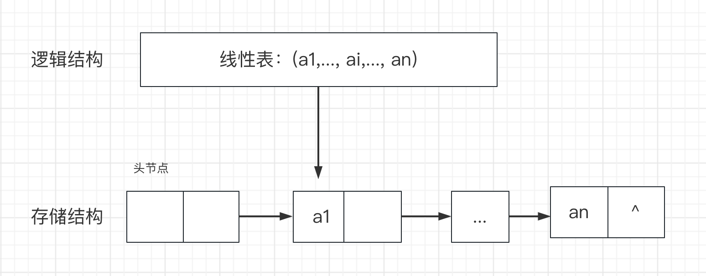

# 2.线性表

## 1.线性表

定义：线性表是具有相同特性的数据元素的一个有限序列。

### 逻辑特征：

- 在非空的线性表，有且仅有一个开始节点，它没有直接前驱，而仅有一个直接后继；
- 有且仅有一个终端节点，它没有直接后继，而仅有一个直接前驱；
- 其余的内部节点都有且仅有一个直接前驱和一个直接后继；

### 存储结构：

线性表有两种基本的存储结构：顺序存储结构和链式存储结构。

---

## 2.线性表的顺序存储

线性表的顺序表示又称为顺序存储结构，即把逻辑上相邻的数据元素存储在物理上相邻的存储单元中的存储结构。



### 2.1.数组

数组是一种线性表数据结构，用一组连续的内存空间来存储一组具有相同类型的元素。因此具备随机访问的特性，而数据的删除、插入操作，为了保证连续性，就需要做大量的数据搬移工作。

随机访问的实现方式：假设线性表的每个元素占x个存储单元，则第i+1个元素的存储位置和第i个数据元素的存储位置之间满足关系：

LOC(ai+1) = LOC(ai) + x

### 2.2.顺序表的插入

ArrayList指定位置插入源码分析： 

```java
public void add(int index, E element) {
    rangeCheckForAdd(index);
    modCount++;
    final int s;
    Object[] elementData;
    if ((s = size) == (elementData = this.elementData).length)
        elementData = grow();
    System.arraycopy(elementData, index,
                     elementData, index + 1,
                     s - index);
    elementData[index] = element;
    size = s + 1;
}
```

1. 检查插入位置是否符合要求，不能大于数组大小或者小于0；
2. 数组大小初始化，或者扩容；
3. 将index位置及之后的元素，拷贝到index+1之后的位置，空出index位置；
4. 将新添加元素放入index位置；

**时间复杂度分析：**

算法时间主要耗费在移动元素的操作上

- 若插入在尾节点之后，则无需移动元素；
- 若插入在首节点之前，则所有元素都需要后移；
- 考虑着各种位置插入(n+1中可能)的平均移动次数，计算方式如下：



顺序表插入算法的平均时间复杂度为O(n).

### 2.3.顺序表的删除

ArrayList删除指定位置元素：

```java
public E remove(int index) {
    Objects.checkIndex(index, size);
    final Object[] es = elementData;

    @SuppressWarnings("unchecked") E oldValue = (E) es[index];
    fastRemove(es, index);

    return oldValue;
}

private void fastRemove(Object[] es, int i) {
    modCount++;
    final int newSize;
    if ((newSize = size - 1) > i)
        System.arraycopy(es, i + 1, es, i, newSize - i);
    es[size = newSize] = null;
}
```

删除流程与插入相似，将第i+1至第n位的元素依次往前移动一个位置。

### 2.4.顺序表的特点

- 利用数据元素的存储位置表示线性表中相邻元素的前后关系，即线性表的逻辑结构与存储结构一致；
- 在访问线性表时，可以快速计算出任何一个数据元素的存储地址，因此可以认为访问每个元素所花的时间相等；

这种存取元素的方法称之为随机存取法。

### 2.5.顺序表的操作算法分析

- 时间复杂度
    - 查找、插入、删除算法的平均时间复杂度为 O(n)；
- 空间复杂度
    - 顺序表操作算法的空间复杂度S(n) = O(1)，没有占用辅助空间；

---

## 3.线性表的链式存储

链式存储结构：节点在存储器中的位置是随意的，即逻辑上相邻的数据元素在物理上不一定相邻。

链式存储组成：

- 节点：数据元素的存储映像，由数据域和指针域两部分组成；
- 链表：n个节点由指针链组成一个链表；



### 3.1.链表的分类

- 单链表：节点只有一个指针域的链表，称为单链表或者线性链表；
- 双链表：节点由两个指针域的链表，称为双链表；
- 循环链表：首尾相接的链表称为循环链表；

### 3.2.链表的特点

- 节点在存储器中的位置是任意的，即逻辑上相邻的数据元素在物理上不一定相邻；
- 访问时只能通过头节点指针进入链表，并通过每个节点的指针域依次向后顺序扫描其余节点，所以寻找第一个节点和最后一个节点所花费的时间不等；

### 3.3.链表的插入

LinkedList指定位置插入元素：

```java
public void add(int index, E element) {
    checkPositionIndex(index);

    if (index == size)
        linkLast(element);
    else
        linkBefore(element, node(index));
}

void linkLast(E e) {
    final Node<E> l = last;
    final Node<E> newNode = new Node<>(l, e, null);
    last = newNode;
    if (l == null)
        first = newNode;
    else
        l.next = newNode;
    size++;
    modCount++;
}

void linkBefore(E e, Node<E> succ) {
    // assert succ != null;
    final Node<E> pred = succ.prev;
    final Node<E> newNode = new Node<>(pred, e, succ);
    succ.prev = newNode;
    if (pred == null)
        first = newNode;
    else
        pred.next = newNode;
    size++;
    modCount++;
}
```

- 检查插入元素位置是否大于等于0且小于等于链表大小；
- 插入元素位置等于链表大小时，使用后插法，将当前的末尾元素作为前置节点，并初始化新节点，然后赋值；
- 在中间位置插入时，需要先找到后置节点，然后重新链接前后节点位置；

### 3.4.链表的查找

LinkedList获取指定位置元素：

```java
public E get(int index) {
    checkElementIndex(index);
    return node(index).item;
}

Node<E> node(int index) {
    // assert isElementIndex(index);

    if (index < (size >> 1)) {
      Node<E> x = first;
      for (int i = 0; i < index; i++)
          x = x.next;
      return x;
    } else {
      Node<E> x = last;
      for (int i = size - 1; i > index; i--)
          x = x.prev;
      return x;
    }
}
```

从头部或者尾部元素，依次查找到上一个元素的位置，直到获取指定位置元素。

### 3.5.线性链表的算法复杂度

- 查找：因线性链表只能顺序存取，查找的时间复杂度为O(n)；
- 插入和删除：
    - 因线性链表不需要移动元素，只要修改指针，一般情况下时间复杂度为O(1)；
    - 如果要在单链表中进行前插或者删除操作，由于要从头查找前驱节点，所耗时间复杂度为O(n);

---